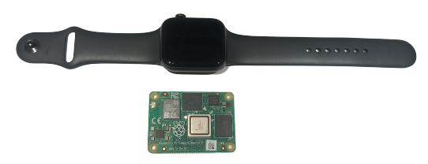

# Compute Module 4

Do you need a very powerful embedded Linux solution that can integrate to your specific use case/PCB/IO board? Maybe you want to run .NET Core, C++ and Python applications? This might be what you need.

I you want to get started right away with flashing the latest Raspberry Pi OS to a Compute Module 4 connected to the official IO Board, read this [Getting started guide](cm4-getting-started.md).

Compute Module 4 is more or less a Raspberry Pi 4 model B but designed for custom PCB's (that's why it has pins instead of ports/connectors). It has a size of 55 x 40 mm.

It has a high-performance ARM 64-bit quad-core processor, dual-display support at resolutions up to 4K, hardware video decode at up to 4Kp60, up to 8GB of RAM, Gigabit Ethernet, USB 2.0, dual camera interfaces, and PCIe Gen 2 x1 interface. Source: [CM4 Product Breif](https://datasheets.raspberrypi.org/cm4/cm4-product-brief.pdf)

It exists in multiple configurations and can be equipped with dual-band 2.4/5.0GHz wireless LAN and Bluetooth 5.0. It can also be configured with onboard eMMC of 8GB, 16GB or 32GB which makes it more suitable for industrial usage (compared to external SD-card).

A Compute Module 4 size comparison with a Apple Watch 5.

## Can I really use a Raspberry Pi in my premium products?

Absolutely, this hardware has probably gone through more reviews and got more feedback that a many companies own in-house built microcontroller solutions.

## Can I create my own OS image?

Yes, there are multiple solutions for that. Raspberry Pi Foundation uses [pi-gen](https://github.com/RPi-Distro/pi-gen) for building their images.

# More info

[Compute Module 4 Datasheet](https://datasheets.raspberrypi.org/cm4/cm4-datasheet.pdf)

