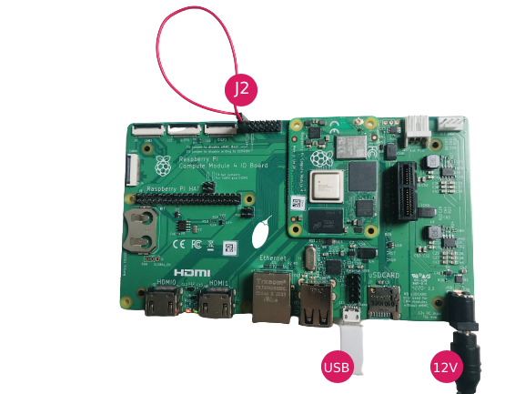
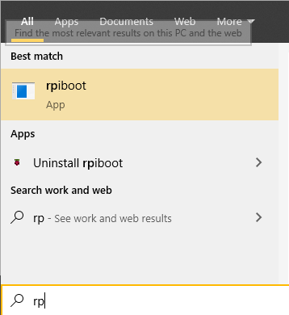
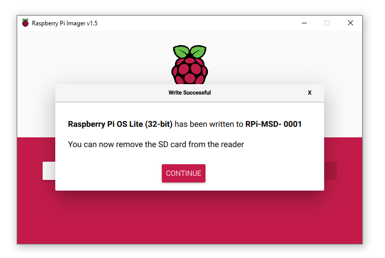

# Compute Module 4 & IO Board - Getting Started Guide

For more general information about the Compute Module see my [introduction page](README.md).

This guide will describe how to set the correct jumper, load required bootloader and flash the latest Raspberry Pi OS image into the on-board eMMC memory.

## Requirements

You will need the following hardware:
- A Compute Module 4 with eMMC memory
- A Compute Module 4 IO Board
- 12 V power to the IO Board
- A micro USB-cable for flashing OS and load required bootloader
- A jumper (or female pin cable or similar)

You will need the following software:
- Windows (will add macOS and Linux guides later)
- [Raspberry Pi Imager](https://www.raspberrypi.org/software/)
- [RPi Boot for Windows](https://github.com/raspberrypi/usbboot/raw/master/win32/rpiboot_setup.exe)

## Let's go

- Install [RPi Boot for Windows](https://github.com/raspberrypi/usbboot/raw/master/win32/rpiboot_setup.exe)
- Put a jumper on the J2 (named "Fit jumper to disable eMMC Boot"), see J2 in the image above.
- Connect the USB between the Compute Module and your computer.
- Connect to power

- Run the RPi Boot, you will probably find it by searching for "rpi" in the Windows menu.

  - If Windows asks to format the drive, press cancel.
- Install [Raspberry Pi Imager](https://www.raspberrypi.org/software/) and open it.
  - Select the OS you prefer and the eMMC drive that is now shown as USB Disk in windows.
  
- Before you unplug the USB Drive, create an empty file called "ssh" in the root folder. That enables the SSH daemon and you can connect to it using username "pi" and password "raspberry".
- Remove the J2 jumper and reboot the device

The Compute Module is now ready for your software.

# More information

[Flashing the Compute Module eMMC by Rapberry Pi Foundation](https://www.raspberrypi.org/documentation/hardware/computemodule/cm-emmc-flashing.md)
