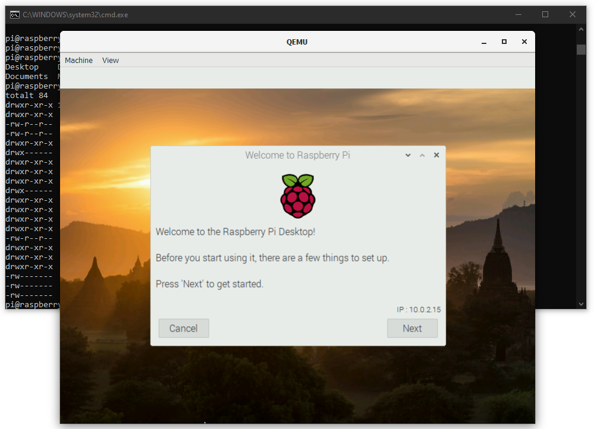

# Emulate Raspberry Pi using QEMU

This page describes how to emulate a Raspberry Pi OS (for ARM CPU's) on your Windows or Mac computer.
This can be very helpful in order to test your Linux ARM applications without need of real hardware.
Maybe you want to test your own Raspberry Pi OS image without needing to wait for it to be flashed - which can be time consuming.



# Download Raspberry Pi and QEMU files

Download
- kernel-qemu-4.19.50-buster
- versatile-pb-buster-5.4.51.dtb

from https://github.com/dhruvvyas90/qemu-rpi-kernel/.

Download
- 2020-08-20-raspios-buster-armhf.img

from http://downloads.raspberrypi.org/raspios_armhf/images/.

# Run Raspberry Pi image (compiled for ARM) in Windows

Download and install QEMU (e.g. qemu-w64-setup-20200814.exe ) from https://qemu.weilnetz.de/w64/2020/.

In the same folder as the files above, chreate a file called run_rpi.bat and paste in the following content:
```
"c:\Program Files\qemu\qemu-system-arm.exe" ^
-kernel kernel-qemu-4.19.51-buster ^
-cpu arm1176 ^
-m 256 ^
-M versatilepb ^
-dtb versatile-pb-buster-5.4.51.dtb ^
-serial stdio ^
-append "root=/dev/sda2 rootfstype=ext4 rw" ^
-hda 2020-02-13-raspbian-buster.img ^
-net nic ^
-net user,hostfwd=tcp::5022-:22 ^
-no-reboot
```

Run the run_rpi.bat

# Run Raspberry Pi image in macOS

Install brew package manager ```/bin/bash -c "$(curl -fsSL https://raw.githubusercontent.com/Homebrew/install/master/install.sh)"```

Install QEMU from Terminal ```brew install qemu```

You might also need to install Xcode command line tools: ```xcode-select --install```

In the same folder as the files above, chreate a file called run_rpi.sh and paste in the following content:
````
export RPI_KERNEL=kernel-qemu-4.19.50-buster
export DTB_FILE=versatile-pb-buster-5.4.51.dtb
export OS_IMAGE=2020-02-13-raspbian-buster.img

qemu-system-arm \
-kernel $RPI_KERNEL \
-cpu arm1176 \
-m 256 \
-M versatilepb \
-dtb ${DTB_FILE} \
-serial stdio \
-append "root=/dev/sda2 panic=1 rootfstype=ext4 rw" \
-drive "file=${OS_IMAGE},index=0,media=disk,format=raw" \
-net nic \
-net user,hostfwd=tcp::5022-:22 \
-no-reboot
```

Best regards,
Mikael Johansson