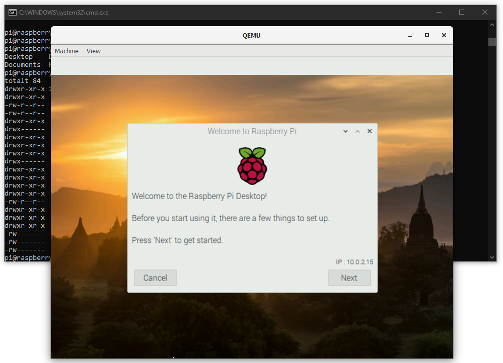

# Run Raspberry Pi image (compiled for ARM) in Windows



Install QEMU (e.g. qemu-w64-setup-20200814.exe ) from https://qemu.weilnetz.de/w64/2020/.

Download kernel-qemu-4.19.50-buster and versatile-pb-buster-5.4.51.dtb from https://github.com/dhruvvyas90/qemu-rpi-kernel.

In the same folder as the files above, chreate a file called run_pi.bat and paste in the following content:
```
"c:\Program Files\qemu\qemu-system-arm.exe" ^
-kernel kernel-qemu-4.19.50-buster ^
-cpu arm1176 ^
-m 256 ^
-M versatilepb ^
-dtb versatile-pb-buster-5.4.51.dtb ^
-serial stdio ^
-append "root=/dev/sda2 rootfstype=ext4 rw" ^
-hda 2020-02-13-raspbian-buster.img ^
-net nic ^
-net user,hostfwd=tcp::5022-:22 ^
-no-reboot
```

Run the run_rpi.bat